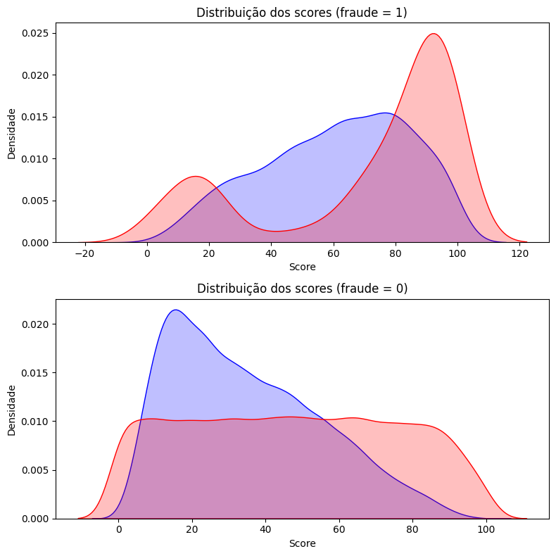

## Overview
Este projeto tem como objetivo analisarmos como transações fraudulentas podem ser identificas em dados de compra de cartão de crédito. Iremos aplicar técnicas de análise estatística de dados, realizar a limpeza e pré-processamento e aplicá-los a um modelo de Machine Learning. O modelo treinado será comparado com o modelo base fornecido na amostra de dados, queremos verificar em como as métricas de negócio se alteram e se conseguimos mapear o perfil das transações fraudulentas.

Além da criação das análises e treinamento de modelo utilizando notebooks Jupyter, modularizamos os códigos de pré processamento e treinamento, criando um pipeline para a validação dos dados, construção e avaliação do modelo, salvando o artefato final possibilitando o monitoramento e a aplicabilidade do classificador a um ambiente de produção. 

Sumário:
1. Entendimento do Negócio
2. Considerações da Análise Estatística
3. Pré-processamento realizado
4. Avaliação do Modelo Criado
5. Estrutura do Projeto e Tecnologias
6. Pipeline de Treinamento
7. Impacto nas métricas do negócio
8. Conclusão e possibilidades de melhoria

## 1. Entendimento do Negócio

O uso crescente de cartões de crédito no Brasil em paralelo com a popularidade de lojas online e benefícios associados, trás muitas facilidades ao dia a dia do consumidor, porém trazendo riscos associados como por exemplo a exposição a tentativas de fraudes de cartão. Em 2023, ocorreram 3,7 milhões de tentativas de fraude, totalizando R$ 3,5 bilhões em prejuízos. Isso destaca a importância de melhorias em sistemas de detecção de fraudes, adicionando e refinando o uso de Inteligência Artificial e Machine Learning visando garantir maior segurança nas transações. Neste projeto iremos tomar o papel de um Cientista de Dados relativo a uma empresa financeira de cartões de crédito, a partir de uma amostra vamos analisar o perfil dos dados e verificar possíveis melhorias ao modelo de detecção atual.

Vamos assumir para este projeto que **10%** do valor de um pagamento corretamente aprovado é revertido em ganhos, enquanto temos um prejuízo de **100%** no caso de fraudes.

Além das métricas usuais de modelos de Machine Learning queremos avaliar:
- *Incoming Pressure*: Taxa de transações fraudulentas recebidas pela quantia total de transações 
- Taxa de Aprovação: Proporção de transações aprovadas após análise 
- Taxa de declínio: Proporção de transações rejeitadas após análise
- Precisão: Proporção de compras ditas como fraudes que realmente são
- Taxa de Detecção (Recall): Quantas fraudes reais o modelo identificou
- Taxa de falsos positivos: Proporção de transações legítimas classificadas como fraudulentas

Mais detalhes sobre o entendimento do negócio e uma visão do contexto dos dados, esta seção é discutida no notebook [1-business-understanding.ipynb](notebooks/1-business-understanding.ipynb).

Os dados utilizados fazem parte da coletânea de cases presentes no [Preparatório para Entrevistas em Dados (PED)](https://www.renatabiaggi.com/ped).

## 2. Considerações da Análise Estatística

Para a análise estatística verificamos o comportamento dos dados utilizando gráficos e testes de hipótese, verificamos que há a presença de variáveis discretas, contínuas e categóricas em nossa amostra. A maioria das distribuições das entradas não possuem um comportamento normal sendo assimétricas e com possíveis outliers, porém com a anonimização da informação, não conseguimos analisar se é conveniente removê-los.

Os testes de hipótese utilizados temos o de Kolgomorov-Smirnov e $\chi^2$.

Como conclusão do EDA, verificamos que poderiamos retirar variáveis de muita cardinalidade categórica e excluir variáveis com um caráter uniforme sem diferenciação entre os casos de fraude e não fraude. Além disso foi possível verificar que aplicar transformações a determinadas variáveis torna suas distribuições mais interpretativas e mais próximas a uma curva normal.

Há uma grande dificuldade na amostra analisada pela presença de um grande desbalanceamento entre as classes, onde possuimos aproximadamente apenas 5% de valores de classe positiva (fraude).

O passo a passo, assim como todos os gráficos e testes realizados estão presentes no notebook [2-eda.ipynb](notebooks/2-eda.ipynb).

## 3. Pré-processamento realizado

Antes de qualquer pré-processamento os dados de treino e teste foram divididos na proporção de 80/20. 

- Excluimos as variáveis:
  - `score_8`, apresenta uma distribuição uniforme e sem variação entre fraude e não fraude.
  - `produto`, apresenta uma grande cardinalidade de categorias
  - `score_fraude_modelo`, o resultado do modelo base 
- Para o tratamento de variáveis numéricas:
  - Preenchemos os valores vazios de variáveis contínuas com a média
  - Já para variáveis discretas preenchemos com a moda
  - Aplicamos transformação log nas variáveis `score_3` e `valor_compra`, onde estas possuiam uma grande quantia de valores pequenos. 
  - Para a variável `score_6` aplicamos uma transformação cúbica, tendo em vista a presença de valores negativos.
- A variável `pais` foi agrupada em continentes.
- A `data_compra` foi transformada em hora do dia e dia da semana.
- Para valores de entrega de documento, preenchemos os vazios com `0` ou seja, não entregue.

Mais detalhes sobre o o pipeline de pré-processamento é possível acessar o notebook [3-modeling.ipynb](notebooks/3-modeling.ipynb).

## 4. Avaliação do modelo criado

Foram realizados testes utilizando os algoritmos RandomForest, XGBoost, LightGBM e Decision Tree. O algoritmo de LightGBM foi o que melhor se sobressaiu frente ao demais, sendo a escolha de utilização para este projeto.

Em seguida foi realizado um finetuning dos hiperparâmetros utilizando Random Search.

Os testes de finetuning foram salvos e monitorados utilizando MLflow, conectado a plataforma DagsHub, os resultados podem ser verificados e compartilhados pelo seguinte link: [Experimentos MLflow](https://dagshub.com/renneruan/fraud-detection.mlflow/#/experiments/0)

Podemos avaliar o modelo criado em 2 contextos de métricas, inicialmente vamos analisar as métricas estatísticas de desempenho do modelo para o limiar padrão utilizando os dados de teste.

| Métrica   | Modelo Novo | Modelo Antigo | Diferença  |
|-----------|-------------|---------------|------------|
| ROC_AUC   | 0.7153      | 0.6574        | 0.0580     |
| Log-loss  | 9.2392      | 16.1307       | -6.8915    |
| Precision | 0.1273      | 0.0834        | 0.0439     |
| Recall    | 0.6838      | 0.7742        | -0.0904    |
| F1        | 0.2147      | 0.1506        | 0.0641     |

Vemos uma melhoria no valor de Área sob a curva, além de uma redução no log-loss, por ser uma métrica inversa, caracterizamos como uma vantagem. A melhoria na precisão veio acompanhada de uma perda no valor de recall. A avaliação das métricas de negócio serão discutidas na conclusão.

Vemos no gráfico a seguir como o novo modelo (curva azul) para os casos de fraude assumiu um comportamento mais homogêneo em relação ao antigo (curva vermelha).



## 5. Estrutura do projeto e tecnologias

Além os estudos em protótipo realizados no notebook, para este projeto os códigos foram repassados para módulos python visando a criação de um pipeline de treinamento e predição, de forma que o modelo pudesse ser aplicado em ambiente de produção. Esta informação é necessária para visualizarmos melhor a estrutura de projetos, mas será melhor explicada na seção 6 deste README.

A estrutura do projeto foi organizada da seguinte forma:
```
├── .github/
│ └── workflows/ 
│ | └── main.yaml  
├── README.md 
├── requirements.txt
├── .env
├── artifacts/
├── assets/
├── config/
│ ├── config.yaml 
│ ├── params.yaml 
│ └── schema.yaml 
├── logs/
│ └── running_logs.log 
├── reports/
│ └── figures/
│ │ └── model_output.png 
├── notebooks/ 
│ ├── 1-business-undestanding.ipynb 
│ ├── 2-eda.ipynb 
│ └── 3-modeling.ipynb 
├── src/
│ ├── init.py 
│ ├── features/
│ | ├── __init__.py 
│ │ └── base_metrics.py 
│ ├── fraud_detection/
│ │ ├── components/
│ | | ├── __init__.py 
│ | | ├── data_transformation.py 
│ | | ├── data_validation.py 
│ | | ├── model_evaluation.py 
│ │ | └── model_trainer.py 
│ │ ├── config 
│ | | ├── __init__.py 
│ │ | └── manager.py 
│ │ ├── constants
│ │ | └── __init__.py 
│ │ ├── entity
│ | | ├── __init__.py 
│ │ | └── config_entity.py 
│ │ ├── pipeline
│ | | ├── __init__.py 
│ | | ├── prediction.py 
│ | | ├── stage_01_data_validation.py 
│ | | ├── stage_02_data_transformation.py 
│ │ | ├── stage_03_model_trainer.py 
│ │ | └── stage_04_model_evaluation.py 
│ │ ├── utils
│ │ | └── __init__.py 
│ │ └── __init__.py 
├── static/
│ ├── style.css 
├── templates/
│ ├── index.html
├── app.py
├── Dockerfile
├── main.py
├── setup.py
```

Foi utilizado o gerenciador de pacotes anaconda, utilizando um ambiente virtual, foi utilizado Python 3.11.

```
conda create -n "fraud-detection" python=3.11 ipython

conda activate fraud-detection
```
Para a instalação dos pacotes utilizados:
```
pip install -r requirements.txt
```

O arquivo requirements contém as bibliotecas utilizadas como Scikit-learn, pandas, matplotlib e MLflow.

Por fim para a utilização do MLflow, é necessário criar um arquivo `.env` na raiz do projeto contendo as chaves de acesso:

```
MLFLOW_TRACKING_URI=https://dagshub.com/{{ Usuário do Repositório }}/{{ Repositório }}.mlflow
MLFLOW_TRACKING_USERNAME={{ Seu usuário }}
MLFLOW_TRACKING_PASSWORD=
```

## 6. Pipeline de Treinamento

Este projeto além do estudo de criação do modelo também se insere em criar um pipeline voltada para a produtização do mesmo.

Foi criado um pipeline de treinamento contendo as etapas de:
- Avaliação do conjunto de dados
- Pré-processamento dos dados
- Treinamento do modelo 
- Avaliação do modelo

Onde os códigos realizados em forma de rascunho nos notebooks foram repassados para os arquivos python (presentes na pasta `src/fraud-detection/components`) tornando a execução do treino do modelo muito mais fácil. O pipeline conta com uma estratégia de log, onde podemos verificar os erros e saídas de execução do treinamento.

Para a execução do pipeline de treinamento, após a instalação dos pacotes necessários, basta executarmos:

```
python main.py
```

O pipeline será executado, e os logs serão salvos na pasta `logs/`. Todas as saídas das etapas, como por exemplo dados transformados, modelo treinado e resultados de métricas serão salvos na pasta `artifacts/`. Por conterem informações sensíveis, elas não estarão presente neste repositório.

## 7. Impacto das métricas de negócio

| Métrica                                | Modelo Novo       | Modelo Antigo      | Diferença          |
|----------------------------------------|-------------------|--------------------|--------------------|
| Limiar ótimo                           | 65                | 72                 | -7                 |
| Ganhos por transações aprovadas (R$)   | 95,829.47         | 80,329.99          | 15,499.48          |
| Prejuízos com fraudes aprovadas (R$)   | 34,098.11         | 25,353.32          | 8,744.79           |
| Receita gerada com limiar ótimo (R$)   | 61,731.36         | 54,976.67          | 6,754.69           |
| Taxa de pressão de entrada (%)         | 5.12              | 5.12               | 0.00               |
| Taxa de aprovação total (%)            | 87.82             | 73.37              | 14.45              |
| Taxa de declínio total (%)             | 12.18             | 25.66              | -13.48             |
| Precisão (%)                           | 20.47             | 13.43              | 7.04               |
| Revocação (%)                          | 48.67             | 68.21              | -19.54             |
| Taxa de falsos positivos (%)           | 10.21             | 23.64              | -13.43             |

Temos um ganho financeiro com a adoção do modelo utilizado, o qual assume um comportamento mais arriscado no que tange a permitir que mais transações sejam realizadas, ou seja, mais aprovações, reduzindo a taxa de declínio. O modelo é um promissor candidato para ser utilizado como o classificador de fraudes da empresa. Os dados utilizados para a criação do mesmo são de compras entre 08/03/2020 e 21/04/2020, referentes a aproximadamente 1 mês.

## 8. Conclusão e melhorias

Com o novo modelo, houve um aumento da receita gerada em R$ 6.754,69, com o comportamento se tornado mais arriscado ao reduzir o limiar de 72 para 65 porém resultando em maior precisão (+7,04%), mas uma redução na revocação (-19,54%).

As dificuldades principais incluíram o grande desbalanceamento das classes, sugerindo a necessidade de técnicas como Oversampling, precisamos verificar a aplicação do TargetEncoder e se este é a melhor opções para valores de alta cardinalidade. A anonimização dos dados dificultou a identificação de outliers e se poderiamos removê-los sem perda de descrição dos dados.

Apesar do desempenho melhor para o negócio, a análise de fraudes requer considerar fatores como experiência do usuário e impacto em reclamações de casos de fraudes que sejam aprovados, que podem influenciar a reputação geral da empresa.

O modelo é um potencial substituto para o modelo atual onde o ganho monetário direto é evidente.


