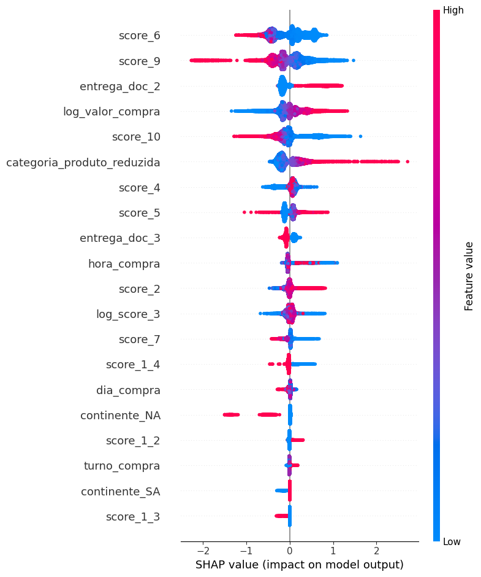

## Overview
Este projeto tem como objetivo a análise de transações fraudulentas em compras de cartão e como elas podem se identificadas da melhor forma utilizando Dados e Machine Learning.

O modelo treinado será comparado com o modelo base fornecido na amostra de dados, queremos verificar em como as métricas de negócio se alteram e se conseguimos mapear o perfil das transações fraudulentas gerando mais lucro para o nosso negócio.

Este projeto não foca somente na entrega de uma análise e um modelo de forma avulsa, mas também engloba etapas e conceitos de MLOps para a produtização do modelo criado, permitindo que ele se torne um produto acessável. O que você irá encontrar neste repositório:

- Análise da situação do negócio
- Análise estatística dos dados de entrada
- Pré-processamento dos dados
- Treinamento e otimização do Modelo de ML
- Acompanhamento e registro das métricas do novo modelo criado
- Código modularizado criando um pipeline de treinamento do modelo ótimo encontrado
- Criação de formulário e API em Flask contendo um pipeline de predição
- Registro de log de execução dos pipelines
- Documentação de todo o código dos pipelines criados
- CI:
  - Criação do documentação em formato HTML automaticamente utilizando Sphinx. (https://renneruan.github.io/fraud-detection/)
  - Aplicação de verificação estática de código utilizando Pylint
  - Testes unitários das funções de pré-processamento criadas
- CD:
  - Criação de imagem Docker contendo o projeto
  - Disponibilização da imagem Docker utilizando AWS ECR
  - Deploy da imagem em máquina EC2 possibilitando requisição e acesso ao modelo.

Os notebooks contendo o processo de análise estão na pasta [notebooks/](notebooks). Os demais códigos estão distribuídos ao longo do projeto em que iremos comentar sobre a estrutura posteriormente, esta também pode ser visualizada na página de documentação.

Os dados utilizados fazem parte da coletânea de cases presentes no [Preparatório para Entrevistas em Dados (PED)](https://www.renatabiaggi.com/ped).

Documentação do Projeto gerada: https://renneruan.github.io/fraud-detection/

Sumário:
- [Overview](#overview)
- [1. Entendimento do Negócio](#1-entendimento-do-negócio)
- [2. Considerações da Análise Estatística](#2-considerações-da-análise-estatística)
- [3. Pré-processamento realizado](#3-pré-processamento-realizado)
- [4. Avaliação do modelo criado](#4-avaliação-do-modelo-criado)
- [5. Estrutura do projeto e tecnologias](#5-estrutura-do-projeto-e-tecnologias)
- [6. Pipeline de Treinamento](#6-pipeline-de-treinamento)
- [7. Pipeline de predição](#7-pipeline-de-predição)
- [8. CI/CD](#8-cicd)
  - [Criação automática de documentação HTML](#criação-automática-de-documentação-html)
  - [Verificação estática de cóidigo](#verificação-estática-de-cóidigo)
  - [Testes unitários](#testes-unitários)
  - [Disponibilização em Docker e Registry](#disponibilização-em-docker-e-registry)
  - [Deploy em máquina virtual](#deploy-em-máquina-virtual)
- [9. Conclusão e possibilidades de melhoria](#9-conclusão-e-possibilidades-de-melhoria)
## 1. Entendimento do Negócio

O uso crescente de cartões de crédito no Brasil em paralelo com a popularidade de lojas online e benefícios associados, trás muitas facilidades ao dia a dia do consumidor, porém trás consigo também riscos associados como por exemplo a exposição a tentativas de fraudes de cartão. Em 2023, ocorreram 3,7 milhões de tentativas de fraude, totalizando R$ 3,5 bilhões em prejuízos. Isso destaca a importância de melhorias em sistemas de detecção de fraudes e como o uso de Inteligência Artificial e Machine Learning podem garantir maior segurança para as instituições e seus clientes. Neste projeto iremos tomar o papel de um Cientista de Dados relativo a uma empresa financeira de cartões de crédito, a partir de uma amostra vamos analisar o perfil dos dados e verificar possíveis melhorias ao modelo de detecção atual.

Vamos assumir para este projeto que **10%** do valor de um pagamento corretamente aprovado é revertido em ganhos, enquanto temos um prejuízo de **100%** no caso de fraudes.

Além das métricas usuais de modelos de Machine Learning queremos avaliar:
- *Incoming Pressure*: Taxa de transações fraudulentas recebidas pela quantia total de transações 
- Taxa de Aprovação: Proporção de transações aprovadas após análise 
- Taxa de declínio: Proporção de transações rejeitadas após análise
- Precisão: Proporção de compras ditas como fraudes que realmente são
- Taxa de Detecção (Recall): Quantas fraudes reais o modelo identificou
- Taxa de falsos positivos: Proporção de transações legítimas classificadas como fraudulentas

Mais detalhes sobre o entendimento do negócio e uma visão do contexto dos dados, temos uma seção direcionada para este tópico em [1-business-understanding.ipynb](notebooks/1-business-understanding.ipynb).


## 2. Considerações da Análise Estatística

Para a análise estatística verificamos o comportamento dos dados utilizando gráficos e testes de hipótese, temos em nossa amostra a presença de variáveis discretas, contínuas e categóricas. A maioria das distribuições das entradas não possuem um comportamento normal sendo assimétricas e com possíveis outliers.

Devido ao caráter não paramétrico utilizamos dos testes de hipótese utilizados Kolgomorov-Smirnov e $\chi^2$ para verificar a significância das variáveis frente a saída de detecção de fraude que almejamos.

Como conclusão da etapa de EDA, verificamos que poderiamos retirar variáveis de muita cardinalidade categórica e excluir variáveis com um caráter uniforme sem diferenciação entre os casos de fraude e não fraude. Além disso foi possível verificar que aplicar transformações a determinadas variáveis torna suas distribuições mais interpretativas e mais próximas a uma curva normal.

Há uma dificuldade de modelagem na amostra analisada pela presença de um grande desbalanceamento entre as classes, onde possuimos aproximadamente apenas 5% de valores de classe positiva (fraude).

O passo a passo, assim como todos os gráficos, testes e conclusões estão presentes no notebook [2-eda.ipynb](notebooks/2-eda.ipynb).

## 3. Pré-processamento realizado

Antes de qualquer pré-processamento os dados de treino e teste tiveram seus outliers removidos e foram divididos na proporção de 80/20. 

- Vamos excluir as variáveis `score_8` e `produto`
- Há variáveis discretas dentre as numéricas
- Podemos aplicar a transformação log as variávels `score_3` e `valor_compra`
- Podemos retirar os outliers relativos a `score_6` (> 483) e `score_5` (> 10)
- A variável `pais` pode ser agrupada em continentes
- Podemos transformar a variável `data_compra` em hora do dia, dia da semana e turno de compra.
- Agrupar as categorias de produto que possuem menos que 3 ocorrências em coluna outros, se torna necessário testarmos com ou sem a adição dessa coluna.
- Para valores de entrega de documento, preenchemos os vazios com `0` ou seja, não entregue.

Mais detalhes sobre o o pipeline de pré-processamento estão presentes no notebook [3-modeling.ipynb](notebooks/3-modeling.ipynb).

## 4. Avaliação do modelo criado

Foram realizados testes utilizando os algoritmos RandomForest, XGBoost, LightGBM e Decision Tree. O algoritmo de LightGBM foi o que melhor se sobressaiu frente ao demais, sendo a escolha de utilização para este projeto.

Em seguida foi realizado um finetuning dos hiperparâmetros utilizando a biblioteca Optuna. Que utiliza otimização Bayesiana (TPE).

Os testes de finetuning foram salvos e monitorados utilizando MLflow, conectado a plataforma DagsHub, os resultados podem ser verificados e compartilhados pelo seguinte link: [Experimentos MLflow](https://dagshub.com/renneruan/fraud-detection.mlflow/#/experiments/0)

Analisamos as métricas estatísticas do modelo comparando-o com o modelo já vigente, inicialmente utilizamos o limiar padrão de 0.5 (a partir do resultado do modelo) para a definição de fraude.

| Métrica   | Model Novo | Modelo Antigo | Diferença |
|-----------|------------|---------------|-----------|
| ROC_AUC   | 0.7184     | 0.6518        | 0.0666    |
| Log-loss  | 8.8837     | 16.2141       | -7.3304   |
| Precision | 0.1263     | 0.0789        | 0.0474    |
| Recall    | 0.6795     | 0.7646        | -0.0851   |
| F1        | 0.213      | 0.143         | 0.07      |

Vemos uma melhoria no valor de Área sob a curva, além de uma redução no log-loss, por ser uma métrica inversa, caracterizamos como uma vantagem. A melhoria na precisão veio acompanhada de uma perda no valor de recall. Avaliamos o modelo também tendo um resgate do limiar ótimo que maximize o lucro. Temos a tabela:

| Métrica                                   | Limiar 79 - Modelo Antigo | Limiar 61 - Modelo Novo   |
|-------------------------------------------|---------------------------|---------------------------|
| Ganhos por transações aprovadas           | R$ 89,287.09              | R$ 90,878.42              |
| Prejuízos com transações fraudulentas aprovadas | R$ 33,122.63              | R$ 28,630.17              |
| Receita gerada com limiar ótimo          | R$ 56,164.46              | R$ 62,248.25              |
| Taxa de aprovação total                  | 80.24%                    | **84.94%**                |
| Taxa de declínio total                   | 18.77%                    | **15.06%**                |
| Precisão do modelo                       | 15.31%                    | **17.65%**                  |
| Revocação do modelo                      | **59.32%**                    | 54.15%                    |
| Taxa de falsos positivos                 | 16.88%                    | **13.04%**                    |

Temos uma melhora do nosso modelo no que tange ao lucro e usabilidade. Mais detalhes serão discutidos na conclusão, e podem ser visualizados no notebook [3-modeling.ipynb](notebooks/3-modeling.ipynb).

Vemos no gráfico a seguir como o novo modelo (curva azul) para os casos de fraude assumiu um comportamento mais homogêneo em relação ao antigo (curva vermelha).


Utilizamos da biblioteca SHAP para verificar quais features de entrada tiveram maior influência nos resultados do modelo.




## 5. Estrutura do projeto e tecnologias

Além dos estudos em protótipo realizados em notebook, para este projeto os códigos foram repassados para módulos python visando a criação de um pipeline de treinamento e predição, de forma que o modelo pudesse ser aplicado em ambiente de produção. Esta informação é necessária para visualizarmos melhor a estrutura de projeto construída.

As pastas de maior interesse para os pipelines construídos são:

`src/fraud_detection/components` que irá conter o código de funcionamento principal dos módulos.
`src/fraud_detection/pipeline` possuindo os arquivos que conectam as configurações com os componentes.

O projeto foi desenvolvido a partir do gerenciador de pacotes Conda, utilizando um ambiente virtual com Python 3.11, o ambiente pode ser criado e ativado com os seguintes comandos:

```
conda create -n "fraud-detection" python=3.11 ipython

conda activate fraud-detection
```

Para a instalação dos pacotes utilizados no pipeline, temos nossas dependências listadas no arquivo `requirements.txt`:
```
pip install -r requirements.txt
```

O arquivo requirements contém as bibliotecas utilizadas como Scikit-learn, pandas, matplotlib e MLflow.

Por fim para a utilização do MLflow em conjunto com o DagsHub é necessário possuirmos tokens de acesso, estes foram armazenados no arquivo `.env`, presente na raiz do projeto contendo as chaves de acesso:

```
MLFLOW_TRACKING_URI=https://dagshub.com/{{ Usuário do Repositório }}/{{ Repositório }}.mlflow
MLFLOW_TRACKING_USERNAME={{ Seu usuário }}
MLFLOW_TRACKING_PASSWORD={{ Seu token }}
```

Mais informações quanto a autenticação do MLfLow com o DagsHub: [MLflow Tracking](https://dagshub.com/DagsHub-Official/dagshub-docs/src/main/docs/integration_guide/mlflow_tracking.md)

## 6. Pipeline de Treinamento
Foi criado um pipeline de treinamento contendo as etapas de:
- Avaliação do conjunto de dados
- Pré-processamento dos dados
- Treinamento do modelo 
- Avaliação do modelo

Onde os códigos realizados em forma de rascunho nos notebooks foram repassados para os arquivos python (presentes na pasta `src/fraud-detection/components`) tornando a execução do treino do modelo muito mais fácil. O pipeline conta com uma estratégia de log, onde podemos verificar os erros e saídas de execução do treinamento.

Temos uma descrição das pastas necessárias para a execução do pipeline:
```
src/fraud-detection/ -> Pasta geral do projeto de pipeline
src/fraud-detection/pipeline/ -> Arquivos que orquestram e unem os componentes
src/fraud-detection/components/ -> Armazenam os módulos principais do pipeline
src/fraud-detection/constants/ -> Armazenam informações constantes a serem utilizadas nos módulos
src/fraud-detection/entity/ -> Arquivos que designam a estrutura das configurações 
src/fraud-detection/config/ -> Configurações a serem repassadas para os módulos 
```

Para a execução do pipeline de treinamento, após a instalação dos pacotes necessários, basta executarmos:

```
python main.py
```

O pipeline será executado, e os logs serão salvos na pasta `logs/`. Todas as saídas das etapas, como por exemplo dados transformados, modelo treinado e resultados de métricas serão salvos na pasta `artifacts/`. Por conterem informações sensíveis, elas não estarão presente neste repositório.

OBS: Os dados necessários devem estar presentes na pasta `artifacts/data_ingestion/`.

## 7. Pipeline de predição

Para o pipeline de predição temos a construção de uma API utilizando Flask `app.py`, além da disponibilização de um formulário contendo valores de entrada aleatórios, onde é possível visualizar como cada um é classificado. (O formulário pode ser encontrado na pasta `static`)

Podemos exercutar a instância flask a partir de `python app.py`


O código interente pode ser visualizado na pasta `src/fraud_detection/pipeline/prediction`. Os dados de entrada recebidos são submetidos ao pipeline de pré-processamento ajustado aos dados de treino utilizados, garantindo o correto tratamento de evitando Data Leakege.

## 8. CI/CD

O processo de CI/CD foi realizado utilizando Github Actions, temos workflows criados para que possamos realizar as seguintes etapas no processo de deploy do nosso modelo.

### Criação automática de documentação HTML

Foi utilizado a biblioteca Sphinx para a leitura automática das docstrings presentes em código, a biblioteca transforma as docstrings em um formato de página, foi utilizado Github pages para a disponibilização da documentação gerada. O processo de envio para o Github Pages também foi automatizado.

### Verificação estática de cóidigo

Aplicação de Pylint para a garantia da qualidade estatática do código, garantindo que não existem variáveis não utilizadas, funções sem documentação dentre outras problemáticas, o Pylint é aplicado ao workflow de integração garantindo uma nota de corte para o código (10). Alterações realizadas também devem seguir esse padrão. Inserimos algumas exceções no que tange a nomeclatura (Permitir variáveis sem snake_case como X, e quantia de funções/parâmetros).

### Testes unitários

Foram criados testes unitários referentes as funções de transformação e pré-processamento dos dados, os testes são executados e se torna necessário que todos tenham sido bem sucedidos para o completo deploy do modelo criado. Os testes foram executados utilizando Pytest.

### Disponibilização em Docker e Registry

Posteriormente após as etapas de integração serem bem sucedidas, nosso projeto será transformado em um contâiner Docker a ser servido utilizado o AWS ECR.

### Deploy em máquina virtual

Após a atualização da imagem utilizando o ECR, temos uma instância EC2 que irá resgatar nossa imagem e executá-la permitindo que os endpoints sejam acessáveis assim como a tela de predição e acesso ao modelo. Isso espelha o funcionamento do modelo tanto em caráter de sistema quanto como a ser utilizado por uma API. 

Devido aos custos ocasianos pela instância em execução, após a estruturação deste projeto, os endpoints foram derrubados, porém caso tenha-se curiosidade em verificar a utilização e funcionamento, basta entrar em contato.


## 9. Conclusão e possibilidades de melhoria


Temos um ganho financeiro com a adoção do modelo utilizado, o qual assume um comportamento mais arriscado se olharmos puramente para o limiar, visualizamos isso também pela permissão de um maior número de transações realizadas, ou seja, mais aprovações, reduzindo a taxa de declínio. O modelo é um promissor candidato para ser utilizado como o classificador de fraudes da empresa. Os dados utilizados para a criação do mesmo são de compras entre 08/03/2020 e 21/04/2020, referentes a aproximadamente 1 mês.

Com o novo modelo, houve um aumento da receita gerada em aumento de 10.83% (R$ 6,083.79 para o mês analisado na amostra), porém com diversas melhoras no que poderiamos considerar a usabilidade de um sistema de detecção de fraude, reduzindo o caso de falsos positivos, e transações declinadas quando no caso de legítimas.

As dificuldades principais incluíram o grande desbalanceamento das classes, sugerindo a necessidade de técnicas como Oversampling, precisamos verificar a aplicação do TargetEncoder e se este é a melhor opções para valores de alta cardinalidade. A anonimização dos dados dificultou a identificação de outliers e se poderiamos removê-los sem perda de descrição dos dados.

Apesar do desempenho melhor para o negócio, a análise de fraudes requer considerar fatores como experiência do usuário e impacto em reclamações de casos de fraudes que sejam aprovados, que podem influenciar a reputação geral da empresa. Ou seja precisamos alinhas ao negócio se a redução de revocação pode ser um fator de impedimento para a adoção do modelo novo.

O modelo é um potencial substituto para o modelo atual onde o ganho monetário direto é evidente.

Melhorias no que tange ao ciclo de Deploy, temos a possibilidade de melhorar o monitoramento das métricas do modelo a partir das inferências recebidas, acoplando um módulo de verificação de concept drift por exemplo. Além disso para este projeto tratamos dados que já tinhamos em mão, onde o processo de ETL dos dados também pode ser um ponto de melhoria e expansão.
